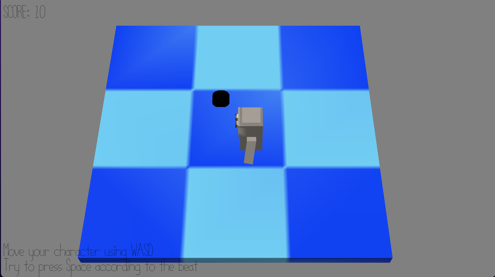

# Dodge Your Bullet

Author: David Zelong Fan

Design: Rhythm game where you shoot bullets according to the rythm. Also, try not to get shot by your bullets.

Screen Shot:

How To Play:

Use WASD to control your character's movement and press SPACE to fire a bullet. The first bullet is worth 10 points, and every bullet after that is worth 10 more points than the previous one if you're in combo. You will lose your score combo if you miss pressing on a drum beat.

Try not to get shot by your own bullet. You can lose up to 1000 points every time you get shot.

Build:
Maekfile fails to rebuild because it was opening too many files. We will need to delete the objs folder every time we try to compile.

This game was built with [NEST](NEST.md).
